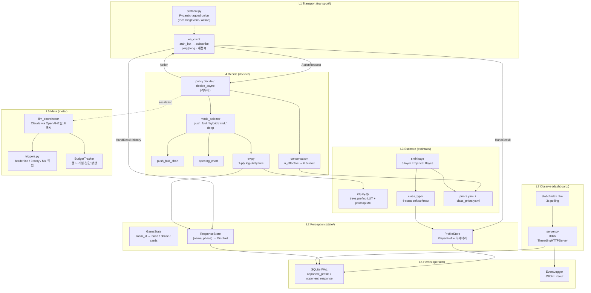
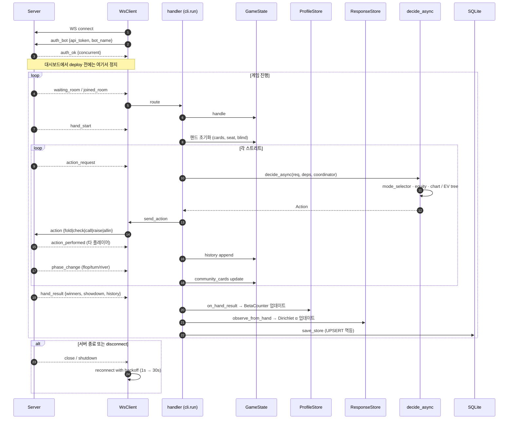
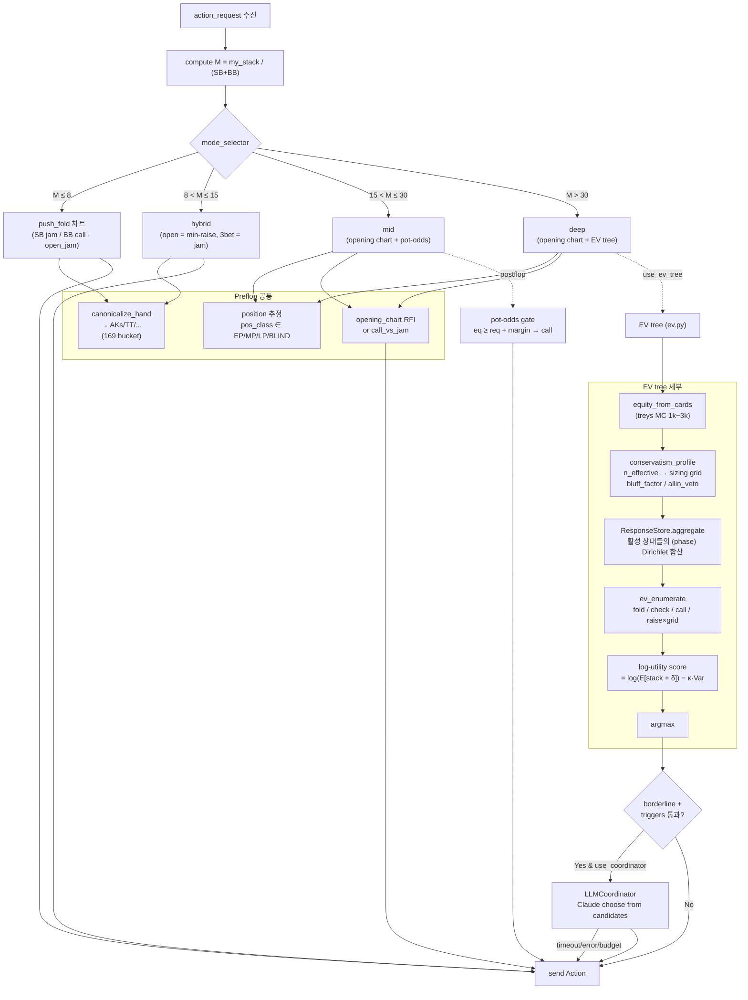
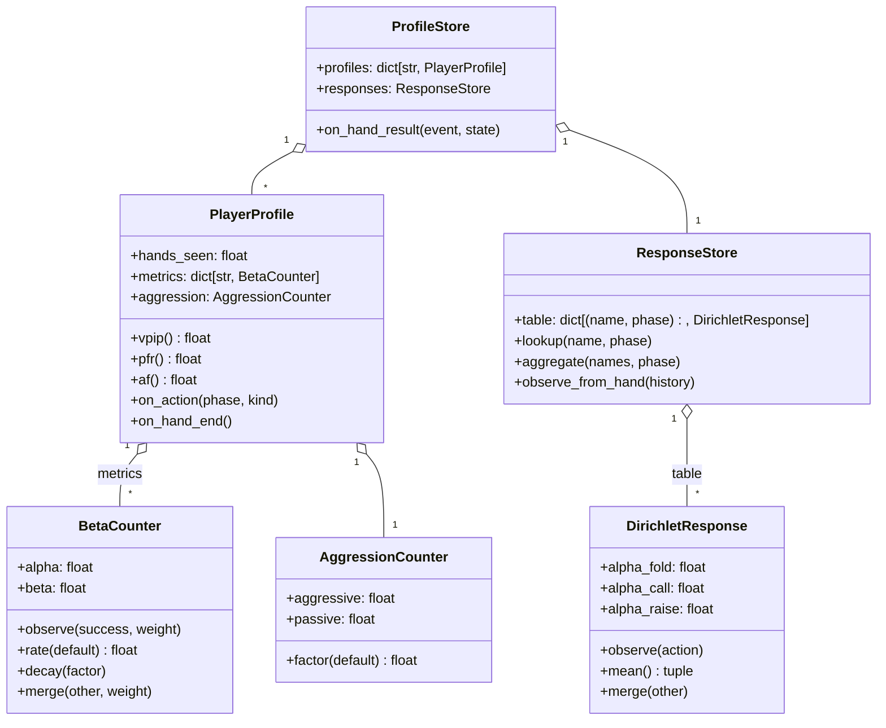
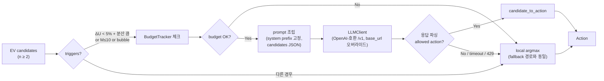
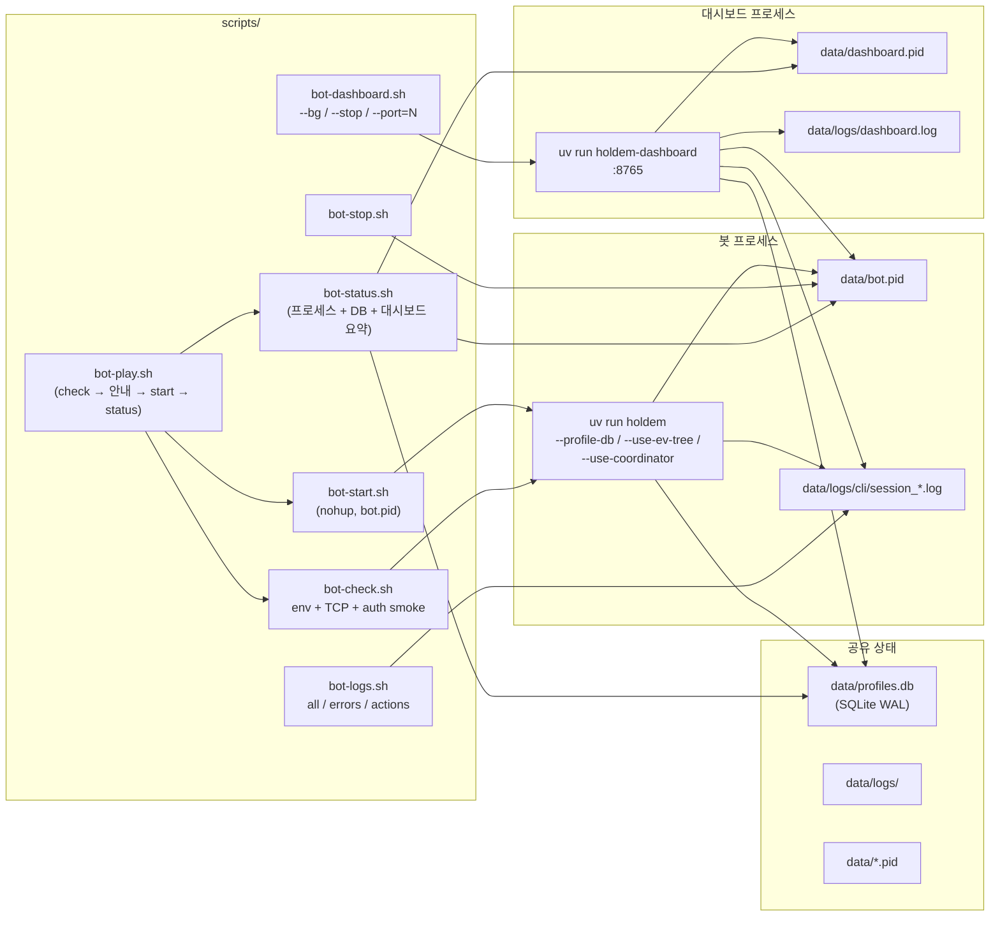
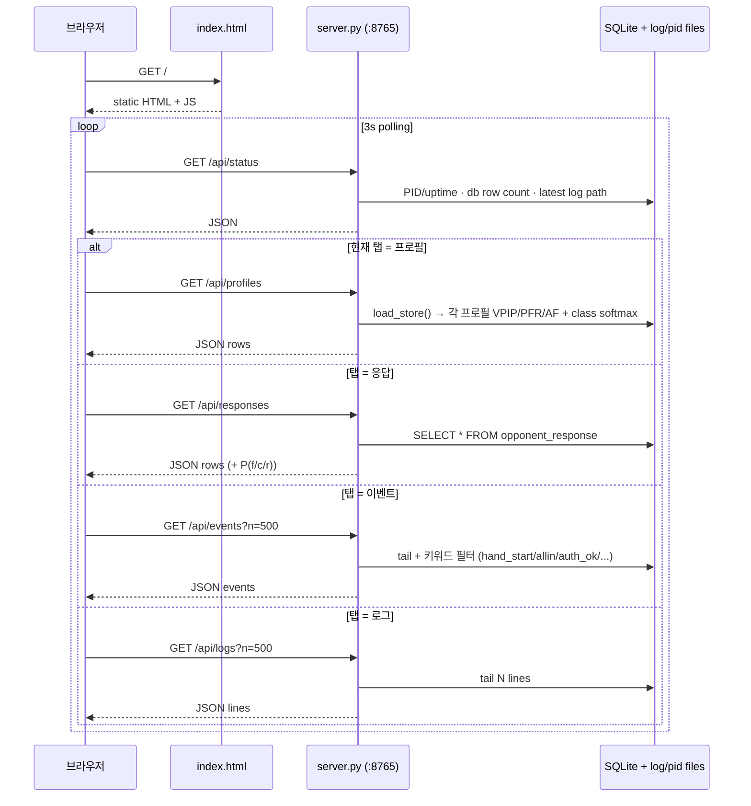
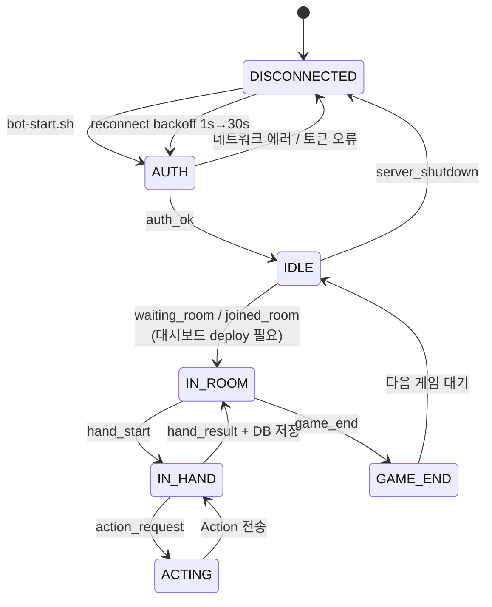
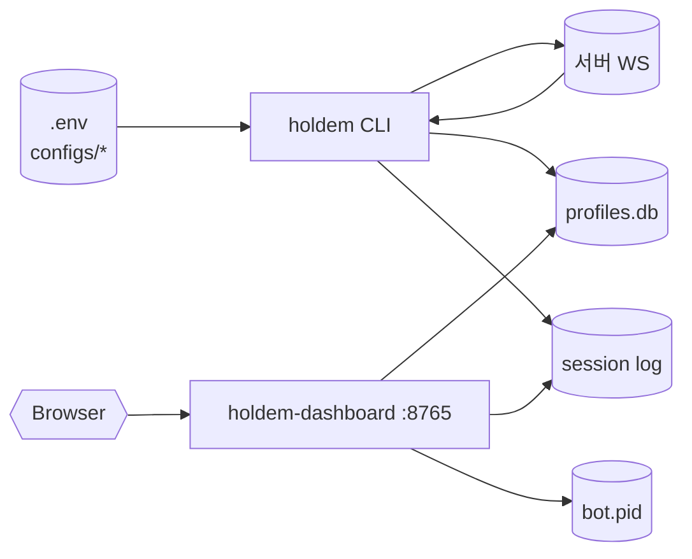

# Holdem Agent — 현 동작 구조

> **문서 목적**: 현재 코드베이스(2026-04-22 기준)의 실제 동작을 기술. 계획 문서(`~/.claude/plans/delegated-doodling-sphinx-md-async-hinton.md`) 의 전체 설계가 아니라 **지금 돌아가는 부분**만 다룬다.
>
> **대상**: 새로 합류하거나 맥락을 잃은 개발자가 "이 봇이 지금 무엇을 하는가" 를 30분 안에 파악할 수 있도록.

---

## 1. 한 줄 요약

Python async WebSocket 봇이 Texas Hold'em 토너먼트 서버에 접속해, **M 값 기반 모드 스위치** 로 Push/Fold 차트 · pot-odds · EV tree 를 구간별로 사용하고, 매 핸드 종료 시 상대 프로필(Beta+Dirichlet)을 SQLite 에 영속시킨다. 브라우저 대시보드(stdlib HTTP)로 상태를 실시간 감시한다.

---

## 2. 레이어 구성



**레이어 분리 원칙** (계획 P1):
- 하위 → 상위 만 참조. 역방향 import 없음.
- L5 Meta 는 escalation gate 통과 시에만 호출. 실패/타임아웃 시 fallback = L4 통계 argmax.

---

## 3. WebSocket 이벤트 라이프사이클



핵심 구현 위치:
- `src/holdem/transport/ws_client.py` — 재접속 루프 + ping/pong
- `src/holdem/cli.py` `handler()` — 이벤트 분기 (33~134줄)
- `src/holdem/state/profile_store.py` — `on_hand_result`
- `src/holdem/state/response_store.py` — `observe_from_hand`

---

## 4. 의사결정 파이프라인



### 4.1 모드 경계 (plan A1 반영)

| 모드 | M 구간 | 전략 |
|---|---|---|
| `push_fold` | M ≤ 8 | 순수 Nash jam/call 차트. postflop 도달 불가 전제 |
| `hybrid` | 8 < M ≤ 15 | preflop open = min-raise, 3bet = jam. postflop 은 commit |
| `mid` | 15 < M ≤ 30 | opening chart + pot-odds call/fold. postflop aggression 보수 |
| `deep` | M > 30 | opening chart + EV tree(log-utility) + coordinator escalation |

### 4.2 ConservatismProfile

`n_effective = n_personal + 0.3·n_class + 0.05·n_pop` 으로 6-bucket (hard/soft/balanced/exploit…) 에 매핑.

- `sizing_grid` (conservative ⊂ balanced ⊂ exploit)
- `bluff_factor` (0.6 → 1.0 연속)
- `allow_allin` (veto 스위치)

파라미터 파일: `configs/conservatism_schedule.yaml`

### 4.3 EV tree 핵심 식

```
U(a) = log(E[stack + δ]) − κ · Var[stack]
δ = BB · max(1, 5 − n_obs / 20)
κ = κ_base · (1 + 2·exp(−n_hands / 100)) · stack_factor · level_factor
```

`ev_raise` 경로에서 상대 반응은 `ResponseStore.aggregate(active_names, phase)` 의 posterior mean 으로 추정.

---

## 5. 상대 프로필 데이터 구조



### 5.1 SQLite 스키마

```sql
-- opponent_profile (하나 행 = 한 상대)
name           TEXT PRIMARY KEY,
hands_seen     REAL,
metrics_json   TEXT,       -- {metric: {alpha, beta}} 전체 블롭
agg_aggressive REAL,
agg_passive    REAL,
updated_at     TEXT

-- opponent_response (복합 키)
name         TEXT,
phase        TEXT,         -- preflop/flop/turn/river
alpha_fold   REAL,
alpha_call   REAL,
alpha_raise  REAL,
updated_at   TEXT,
PRIMARY KEY (name, phase)
```

- 매 `hand_result` 시점에 `save_store()` 로 UPSERT (plan P7 멱등성).
- WAL 모드 + synchronous=NORMAL. 대시보드 읽기와 봇 쓰기가 락 없이 공존.

### 5.2 3-Layer Shrinkage (H.1)

```
α_eff = α_personal + w_class · α_class + w_pop · α_pop
w_class    = n / (n + τ_class)            τ_class ≈ 8
w_pop      = (τ_class − n) / (τ_class + τ_pop) · clamp(0,1)
w_personal = 1 − w_class − w_pop
```

`n` 이 작을수록 population prior 로, 커질수록 개인 posterior 로 연속 이동.

---

## 6. LLM Coordinator (L5)



- **모델 선택**: `configs/llm.yaml` — sonnet 기본, critical 구간만 opus.
- **안전 가드**: LLM 이 **선택지 밖 액션 생성 금지**. 스키마 검증 실패 → fallback.
- **비용 상한**: `BudgetTracker` per_hand / per_game / per_day 세 축.
- **현재 상태**: `--use-coordinator` 플래그 미활성 시 전 경로에서 LLM 미호출.

---

## 7. CLI · 스크립트 레이어



---

## 8. Dashboard 동작



- **의존성 Zero**: stdlib `http.server` 만. 외부 패키지 미사용.
- **포트**: 기본 8765 (`HOLDEM_DASHBOARD_PORT` 으로 변경).
- **바인딩**: `127.0.0.1` 만 — 외부 노출 의도 없음.

---

## 9. 설정 파일 지도

| 파일 | 역할 | 소비자 |
|---|---|---|
| `.env` | `HOLDEM_WS_URL` / `HOLDEM_API_TOKEN` / `HOLDEM_BOT_NAME` | `cli.py`, `bot-check.sh` |
| `configs/priors.yaml` | population-level Beta α,β (VPIP/PFR/CBET/...) | `estimate/priors.py` |
| `configs/class_priors.yaml` | 4-class centroid + per-class Beta | `estimate/class_typer.py` |
| `configs/conservatism_schedule.yaml` | n_effective → (grid, bluff_factor, λ, allow_allin) | `decide/conservatism.py` |
| `configs/sizing.yaml` | 3단계 sizing grid | `decide/sizing.py` |
| `configs/nash_charts/*.yaml` | Push/Fold · open_jam · call_vs_jam (169×M_bucket) | `decide/push_fold_chart.py` |
| `configs/open_ranges/*.yaml` | RFI / 3bet / 4bet chart | `decide/opening_chart.py` |
| `configs/blind_schedule.yaml` | 레벨별 SB/BB (R1 분석) | 현재 참조 없음 (문서용) |
| `configs/llm.yaml` | default/critical 모델, max_tokens, budget | `meta/llm_coordinator.py` |

---

## 10. 실행 흐름 (현재 운영 시나리오)



**중요 제약** (BOT_GUIDE §2.2):
- `auth_ok` 상태만으로는 방 배정 안 됨. **대시보드에서 deploy 버튼** 수동 조작 필요.
- 서버는 동일 `bot_name` 으로 **WS 연결 1개만** 허용 → auth smoke 와 봇 프로세스 공존 불가.

---

## 11. 테스트 구성

- 총 ~300 테스트 (pytest). 카테고리:
  - `test_protocol.py` · `test_ws_client.py` — L1
  - `test_player_profile.py` · `test_response_store.py` · `test_profile_store.py` — L2
  - `test_equity.py` · `test_odds.py` · `test_class_typer.py` · `test_shrinkage.py` — L3
  - `test_push_fold_chart.py` · `test_opening_chart.py` · `test_conservatism.py` · `test_ev.py` · `test_policy.py` — L4
  - `test_llm_coordinator.py` · `test_budget.py` · `test_triggers.py` — L5
  - `test_persist_db.py` · `test_persist_response.py` — L6
  - `test_simulate.py` — 6 baseline + HU 엔진 7 test

실행: `uv run pytest -q`

---

## 12. 현 미완 · 알려진 한계

| 항목 | 상태 | 계획 섹션 |
|---|---|---|
| Deploy API 자동화 | ⚠ 수동 | B4 블로커 |
| Nash 차트 공식 출처 확보 | ⚠ placeholder | R5 |
| R6 A/B 검증 | 미진행 | R6 |
| Multi-way(3~9인) 시뮬레이터 | ⚠ HU only | H.8 |
| Side pot | ⚠ 단일 pot | engine.py 한계 |
| 블라인드 상승 시뮬 | ⚠ 고정 | engine.py 한계 |
| LLM snapshot test | 경로 예약만 | D7 미완 |
| AF 지표 정규화 | ⚠ passive 희소 시 폭주 | dev_log r4 §5 |
| Bootstrap 결과 → priors.yaml 주입 | 미진행 | H.9 Step 4 |

---

## 13. 핵심 파일 지도 (빠른 탐색)

```
src/holdem/
├── cli.py                           # 엔트리: asyncio + reconnect
├── transport/
│   ├── ws_client.py                 # auth · subscribe · ping · 재접속
│   └── protocol.py                  # Pydantic tagged union
├── state/
│   ├── game_state.py                # room_id → 휘발성
│   ├── player_profile.py            # Beta + AF
│   ├── profile_store.py             # 영속 입구
│   └── response_store.py            # Dirichlet 저장소
├── estimate/
│   ├── equity.py                    # treys preflop LUT + postflop MC
│   ├── class_typer.py               # 4-class softmax
│   ├── shrinkage.py                 # 3-layer
│   ├── priors.py                    # yaml 로더
│   └── board_texture.py             # H.5
├── decide/
│   ├── policy.py                    # 최상위 라우터 (decide / decide_async)
│   ├── mode_selector.py             # M → mode
│   ├── push_fold_chart.py
│   ├── opening_chart.py
│   ├── conservatism.py              # 6-bucket 프로파일
│   ├── ev.py                        # 1-ply log-utility tree
│   └── sizing.py
├── meta/
│   ├── llm_coordinator.py           # escalation → Claude
│   ├── llm_client.py                # OpenAI-호환 프록시
│   ├── triggers.py
│   └── budget.py
├── persist/
│   ├── db.py                        # SQLite + UPSERT
│   └── event_log.py                 # JSONL in/out
├── simulate/
│   ├── engine.py                    # HU NLHE 시뮬
│   └── strategies.py                # 6종 baseline
└── dashboard/
    ├── server.py                    # :8765 stdlib HTTP
    └── static/index.html            # 3s polling UI

scripts/
├── bot-check.sh / bot-start.sh / bot-stop.sh
├── bot-status.sh / bot-logs.sh / bot-play.sh
├── bot-dashboard.sh
├── bootstrap_sim.py                 # 6 baseline 자기대전
└── (EDA 스크립트 — J.x)
```

---

## 14. 요약 도표



**현재 한 줄 상태**: `holdem` 봇 프로세스 + `holdem-dashboard` 프로세스 2개가 SQLite/로그 파일을 매개로 느슨 결합. 서버와는 단일 WS 연결. 의사결정은 M 모드 스위치로 분기, 상대 프로필은 매 핸드 UPSERT 로 영속.
