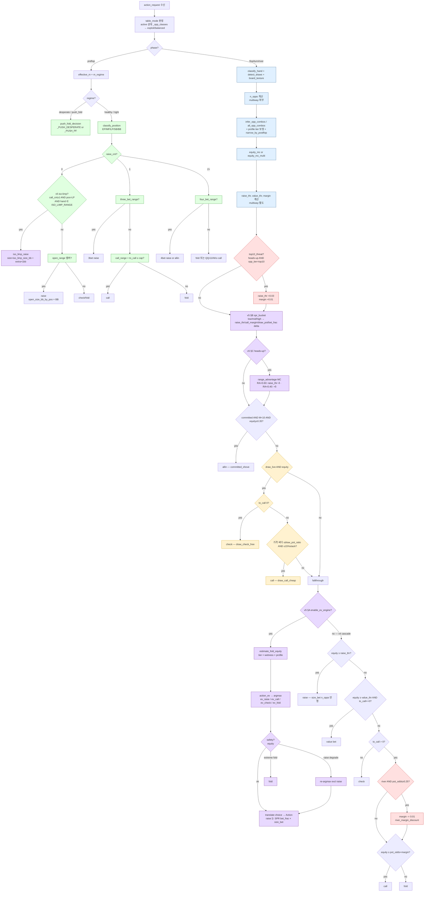

# 봇 의사결정 로직

관련: [WORKFLOW.md](./WORKFLOW.md) · [GLOSSARY.md](./GLOSSARY.md) · [strategy/CHANGELOG.md](./strategy/CHANGELOG.md)

> 이 문서는 **현재 코드 기준(v5 시점) 에 봇이 포커 판에서 뭘 보고 뭘 고르는지** 를 정리한다. 버전별 변경 히스토리(v0/v1/v2/v3/v4/v5) 와 임계값 숫자의 최종 근거는 [`strategy/CHANGELOG.md`](./strategy/CHANGELOG.md) 에 있다. 이 문서는 "지금 어떻게" 만.

---

## 1. 전체 플로우 (v5)

---

## 2. 핵심 구성 요소

| 단계 | 함수/파일 | 하는 일 |
|---|---|---|
| 모드 판정 | `BalancedStrategy._resolve_mode_for_request` + `opponent_class.resolve_table_mode` | 활성 상대 `_opp_classes` 보고 `exploit`/`balanced` 결정. 현재 balanced 경로는 exploit 과 동일 (v5 에서 분기 예정) |
| 포지션 | `position.classify_position(seat, players)` | 2~9명 인원별 seat → EP/MP/LP/SB/BB |
| M-ratio | `tournament.effective_m(req)` | `my_stack / (SB+BB)` |
| 레짐 | `tournament.m_regime(m, cfg)` | healthy(≥20) / tight(≥12) / push_fold(≥7) / desperate(<7) (기본값, CHANGELOG v3 참조) |
| 프리플롭 진입 | `preflop_ranges.open_range(pos)` | 포지션별 frozenset (EP~12%, MP~18%, LP~27%, SB 유사) |
| 3bet/4bet | `preflop_ranges.three_bet_range(pos, vs_pos)`, `four_bet_range()` | IP 면 blufff 섞인 넓은 3bet, OOP 면 value. 4bet 은 AA/KK/AKs only |
| 콜드 콜 | `preflop_ranges.call_range(pos, vs_pos)` | IP/OOP 차등 |
| Short-stack shove | `tournament.push_fold_decision` | M<push_fold 시 위임. faced_shove 면 `_BB_CALL_VS_SHOVE` 만 call |
| 메이드 핸드 | `hand_eval.classify_hand(hole+board)` | 9 카테고리 (high_card=1 ~ straight_flush=9) |
| 드로우 감지 | `draw_detect.detect_draws(hole, board)` | flush_draw (9 out), OESD (8 out), gutshot (4 out), is_live_draw |
| 보드 텍스처 | `board.board_texture(board)` | flush_draw/flush_made/straight_draw/paired/monotone/wetness(0~3) |
| 멀티웨이 카운트 | `_active_nonfolded_opps(players, my_seat)` | n_opps ≥ 2 면 multiway |
| 상대 레인지 | `opp_range.infer_opp_combos`/`all_opp_combos`/`estimate_tier(…, profile=)` | 프리플롭 액션 기반 tier + VPIP profile 로 tighten/widen |
| 레인지 좁히기 | `opp_range.narrow_by_postflop` | flop raise→top_pair+, turn raise→two_pair+ |
| Equity | `equity.equity_mc` / `equity_mc_multi` | 1:1 또는 멀티웨이 MC. multiway_min_samples_per_opp 로 동적 증가 |
| 동적 사이징 | `board.size_bet(phase, equity, texture, pot, min_raise, stack, cfg, n_opps)` | dry/wet × strong/value × 멀티웨이 variant. river value mult. v5 에서 SPR `bet_frac_mult` 가 최종 곱셈 |
| v5 fold-equity | `ev_engine.estimate_fold_equity(tier, wetness, profile, phase, multiway)` | tier × wetness 테이블 + profile fold_to_cbet blend. cap 적용 |
| v5 EV argmax | `ev_engine.action_ev(equity, pot, to_call, stack, raise_size, fe)` | ev_raise/ev_call/ev_check/ev_fold 산출 후 argmax → `EVResult.choice` |
| v5 SPR tree | `spr_tree.spr_value / spr_bucket / adjust_for_bucket` | SPR = stack/pot → low/mid/high 버킷. `SPRAdjust` (raise_thr/call_margin/draw_pot_ratio/bet_frac_mult) 반환 |
| v5 레인지 우위 | `range_advantage.hero_range_combos / range_advantage` | 프리플롭 action sequence 로 내 combo 재구성, opp combos 와 MC. heads-up 만 |
| v5 iso-limp range | `preflop_ranges.ISO_LIMP_RANGE` (59 combos) | LP 에서 limp 대응 iso-raise 범위 |
| 결정 메타 | `_build_meta(req, action, flags)` | `action.meta` 에 근거 dict (equity/pot_odds/pos/m_ratio/regime/hand_key/reason/draw_*/table_mode/spr/ra/ev_*/iso_* 등) |

---

## 3. 결정당 계산 순서 (포스트플롭)

매 `action_request` 에서 순서대로 수행되는 연산:

1. **상태 스냅샷** — seat, my_stack, to_call, pot, min_raise, community_cards, action_history 수집
2. **메이드 + 드로우** — `classify_hand` (카테고리 랭크 1~9), `detect_draws` (outs, is_live_draw)
3. **보드 텍스처** — wetness 0~3
4. **멀티웨이 판정** — `n_opps = _active_nonfolded_opps(...)`
5. **상대 레인지**:
   - multiway → `all_opp_combos(req, profiles=self._profiles, ...)` 로 상대별 tier combos 리스트
   - heads-up → `infer_opp_combos(req, profiles=...)` 로 primary threat 1명
   - 각 combo 리스트에 `narrow_by_postflop` 적용
6. **Equity MC** — `equity_mc_multi` (multiway) 또는 `equity_mc`. 2000 샘플 이상(multiway 시 500×(n+1))
7. **임계값 계산**:
   - raise_thr = multiway ? `equity_raise_threshold_multiway_base + penalty*(n_opps-2)` : `equity_raise_threshold`
   - value_thr = multiway ? `value + 0.05*(n_opps-1)` : value
   - margin = multiway ? `equity_call_margin_multiway + 0.02*(n_opps-2)` : `equity_call_margin`
   - **v5 §B SPR**: `spr = stack/pot` → bucket → delta 합산 (raise_thr / call_margin / draw_pot_ratio). bet 사이즈는 `bet_frac_mult` (low=1.2, high=0.8).
   - **v5 §C range_advantage** (heads-up): `hero_range_combos` + `range_advantage` MC → RA > high_thr: raise_thr − delta · RA < low_thr: raise_thr + delta.
8. **분기 결정** — committed shove → draw-only → **(v5 §A) EV argmax** (enable_ev_engine=True) · 아니면 v4 cascade (raise_strong → value_bet → call → fold/check) (플로우차트 §1 참조). EV argmax 뒤 safety floor: `equity<ev_raise_equity_floor` AND choice=raise → re-argmax 제외, `pot_odds≥ev_extreme_pot_odds_fold` AND equity<pot_odds → 강제 fold.
9. **meta 병합 + 로깅** — `_build_meta` + `_log_decision` + `dumper.outbound(..., meta=...)`

총 결정 시간: v4 ~20~50 ms. v5 는 heads-up RA MC (+15~30ms) 추가 — timeout_ms=3000 대비 여유.

---

## 4. 주요 임계값 (v5 기본값)

**이 값들의 최종 근거와 v0/v1/v2/v3/v4/v5 변경 내역은 [`strategy/CHANGELOG.md`](./strategy/CHANGELOG.md) 참조.** 여기서는 현재 실행값만:

| 분류 | 필드 | 기본값 |
|---|---|---|
| Equity | `equity_raise_threshold` | 0.80 |
| Equity | `equity_value_bet_threshold` | 0.62 |
| Equity | `equity_call_margin` / `_multiway` | 0.03 / 0.07 |
| Equity | `equity_raise_threshold_multiway_base` | 0.87 |
| MC | `mc_samples` / `multiway_min_samples_per_opp` | 2000 / 500 |
| Preflop | `open_size_bb_by_pos` | `{EP:3.5, MP:3.0, LP:2.5, SB:2.5, BB:2.0}` |
| Preflop | `three_bet_mult_ip` / `_oop` / `four_bet_mult` | 3.0 / 3.5 / 2.3 |
| Preflop | `preflop_call_cap_bb` | 10.0 |
| M-ratio | `m_healthy` / `m_tight` / `m_push_fold` / `m_desperate` | 20 / 12 / 7 / 3 |
| Multiway | `multiway_raise_penalty` | 0.10 |
| Bet sizing (heads-up) | `bet_frac_dry/wet × strong/value` | 0.5 / 0.75 / 0.33 / 0.6 |
| Bet sizing (multiway) | `bet_frac_*_multiway` | 0.33 / 0.5 / 0.25 / 0.33 |
| River | `river_value_mult` | 1.2 |
| River (v4) | `river_call_margin_discount` / `river_call_pot_odds_min` | 0.01 / 0.25 |
| Top10 편향 (v4) | `top10_raise_thr_bonus` / `top10_call_margin_bonus` | 0.03 / 0.01 |
| Draw | `draw_call_pot_ratio_max` | 0.35 |
| Draw | `draw_call_stack_ratio_max` | 0.15 |
| Draw | `draw_no_aggression` | True |
| Profile | `profile_min_hands` / `vpip_tight` / `vpip_wide` | 15 / 0.18 / 0.30 |
| Mode | `mode` | `"auto"` |
| **v5 §A toggles** | `enable_ev_engine` / `enable_spr_tree` / `enable_range_advantage` / `enable_iso_limp` | True / True / True / True |
| **v5 §A FE caps** | `ev_fe_top10_cap` / `ev_fe_default_cap` | 0.45 / 0.65 |
| **v5 §A safety** | `ev_raise_equity_floor` / `ev_extreme_pot_odds_fold` | 0.35 / 0.6 |
| **v5 §B SPR 버킷** | `spr_low_max` / `spr_high_min` | 3.0 / 10.0 |
| **v5 §B SPR deltas** | `spr_raise_thr_low/high` · `spr_call_margin_low/high` · `spr_draw_pot_low/high` | 0.05 / 0.05 / 0.02 / 0.02 / 0.05 / 0.05 |
| **v5 §B SPR bet mult** | `spr_bet_frac_low` / `spr_bet_frac_high` | 1.2 / 0.8 |
| **v5 §C range_advantage** | `range_advantage_samples` / `ra_high_threshold` / `ra_low_threshold` / `ra_raise_thr_delta` | 400 / 0.60 / 0.40 / 0.04 |
| **v5 §J iso-limp** | `iso_limp_size_bb` · `ISO_LIMP_RANGE` 크기 | 3.5 / 59 combos |

---

## 5. 결정 근거 로깅 (`action.meta`)

매 결정마다 `Action.meta: dict | None = Field(default=None, exclude=True)` 에 다음이 기록됨 (네트워크로는 `exclude=True` 로 나가지 않음, `.debug/room_*.jsonl` 의 outbound 레코드에만 병합):

### 공통
`hand_number`, `phase`, `seat`, `your_cards`, `community_cards`, `to_call`, `pot`, `min_raise`, `my_stack`, `action`, `amount`, `reason`

### 프리플롭 추가
`pos`, `m_ratio`, `regime`, `hand_key`, `facing_raise_cnt`, `active_n`, `is_pair`, `is_suited`, `vs_pos`, `open_size`, `open_size_bb`, `threebet_size`, `fourbet_size`, `call_cap`

### 포스트플롭 추가
`equity`, `pot_odds`, `equity_ms`, `mc_samples`, `made_hand`, `made_hand_ko`, `opp_tier`, `opp_threat`, `opp_combos_n`, `multiway`, `n_opps`, `texture_wetness`, `texture_flush_draw`, `texture_flush_made`, `texture_straight_draw`, `texture_straight_made`, `texture_paired`, `raise_thr`, `value_thr`, `committed`, `bet_target`

### 드로우 (v3)
`draw_flush`, `draw_flush_made`, `draw_oesd`, `draw_gutshot`, `draw_outs`, `draw_live`, `draw_price_pot`, `draw_price_stack`, `draw_too_expensive`

### 듀얼 모드 (v3)
`table_mode` (exploit/balanced), `cfg_mode` (auto/exploit/balanced), `profiles_loaded`

### Top10·River 보정 (v4)
`top10_threat` (bool, heads-up + opp_tier=="top10" 일 때만 True — raise_thr/margin 에 보수 bonus 적용됨),
`river_margin_discount` (bool, phase==river AND pot_odds>=0.25 에서만 기록 — margin 추가 완화 적용)

### v5 추가 필드

- **SPR tree** (§B): `spr` (float, stack/pot), `spr_bucket` (`low`/`mid`/`high`), `spr_raise_thr_delta` (적용된 raise_thr 조정), `spr_bet_frac_mult` (bet 크기 배수).
- **range_advantage** (§C, heads-up only): `range_advantage` (float [0,1] 또는 null if multiway/disabled), `ra_delta` (적용된 raise_thr 조정).
- **EV engine** (§A): `fe` (estimated fold equity), `ev_raise` / `ev_call` / `ev_check` / `ev_fold` (각 action EV 수치), `ev_choice` (argmax 결과), `ev_safety` (safety floor 가 덮어썼으면 사유 string, else null).
- **iso-limp** (§J): `facing_limp_cnt` (limp 수), `iso_limpers` / `iso_size` (iso-raise 발동 시만).

### `reason` 값 목록 (자주 나오는 것)
- Preflop: `push_fold_desperate` / `push_fold_push_fold` / `open_raise` / `three_bet` / `four_bet` / `cold_call` / `fold_vs_raise` / `call_vs_3bet_premium` / `bb_check_unopened` / `unopened_check` / `unopened_fold` / `check_vs_raise_ignored` / `check_vs_3bet` / `fold_vs_3bet`
- Preflop (v5): `iso_limp_raise`
- Postflop: `committed_shove` / `raise_strong` / `bet_strong` / `value_bet` / `positive_ev_call` / `negative_ev_fold` / `call_cap_exceeded` / `check_free`
- Postflop (v5 EV engine): `ev_raise_strong` / `ev_raise_thin` / `ev_raise_bluff` / `ev_value_bet` / `ev_call` / `ev_check` / `ev_fold` / `ev_call_cap_exceeded` / `ev_bluff_blocked_fold` / `ev_extreme_fold`
- Draw (v3): `draw_check_free` / `draw_call_cheap`

대시보드 `flow.py::decision_overlay_html` 이 이 meta 를 받아 각 내 결정 옆에 `equity X% · pot_odds Y% · made=Z · reason=R · opp=T` 로 렌더.

---

## 6. 듀얼 모드 뼈대 (v3 도입, v5 현재 그대로 유지)

**현재는 분류·기록까지만**. v5 구조적 재설계에서도 balanced 경로 mixed-strategy 분기는 이월 (v5.x). `_resolve_mode_for_request` → `table_mode` 메타 기록은 유지.

- `opponent_class.classify_opponent(profile)` → `unknown | script | adaptive`
- `BalancedStrategy._opp_classes` 에 전체 프로필 분류 캐시
- `_resolve_mode_for_request(req)` 가 이번 핸드 활성 상대 분류 보고 `table_mode` 결정:
  - adaptive 1명이라도 있으면 `balanced`
  - 전원 script 면 `exploit`
  - 그 외(unknown 포함) → `balanced` (보수적 기본값)
- `cfg.mode` 가 `"exploit"` / `"balanced"` 이면 강제
- `table_mode` 와 `cfg_mode` 는 meta 로 기록 — 대시보드에서 확인 가능하지만 실제 분기는 아직 없음

v5.x 이월:
- 3bet bluff 빈도 (IP: JJ/AQs → bluff 포함)
- Bet sizing randomization (dry 강 → 0.33/0.5/0.75 분산)
- Borderline hand 혼합 결정 (hash(hand+seed)%100 으로 fold/call/raise 분포 유지)
- 자체 적대 봇 시뮬 (`scripts/adversarial_sim.py`)

---

## 7. 버전 히스토리

- **v0**: 룰 기반 엔트리 + equity vs pot odds (raise 없음, CALL_FLOOR=16)
- **v1**: Position · M-ratio · Preflop Raise · Multiway · Board Texture (기반 구축)
- **v2**: 멀티웨이 페널티 · Position 오픈사이즈 · Desperate 축소 · Opponent Profile 소비
- **v3**: Flush Draw 규칙 · 상대 분류기 · 듀얼 모드 뼈대
- **v4**: Equity 캘리브레이션 재조정 · BB defense 확장 · top10·river 보수 편향
- **v5**: 구조적 재설계 — EV argmax 엔진 (§A) · SPR tree (§B) · range_advantage (§C) · iso-limp 분기 (§J). v4 cascade 는 토글-off fallback 으로 보존.

각 버전의 동기/변경/파라미터 diff/측정/리스크는 **[`strategy/CHANGELOG.md`](./strategy/CHANGELOG.md)** 가 유일한 권위 있는 출처.

새 버전 추가 시 **CHANGELOG 맨 위에 섹션 추가** (LOGIC.md 는 "지금 어떻게" 만 유지, 과거는 CHANGELOG).

---

## 요약 한 줄

**포지션 / M-ratio / 보드 텍스처 / 멀티웨이 / 드로우 / 상대 프로필 / 듀얼 모드를 모두 고려해 equity·pot odds·상대 레인지로 결정하는 룰 기반 포커 엔진. 결정 근거 전체를 `action.meta` 에 담아 `.debug/room_*.jsonl` outbound 레코드에 병합 기록.**
